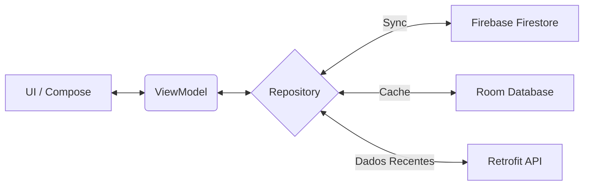

# 🌦️ WeatherApp
### Seu monitor climático inteligente, conectado e offline-first.

 

> **"Não é apenas sobre ver a previsão. É sobre estar preparado."**

---

## 🚀 A Experiência WeatherApp

O **WeatherApp** é um projeto moderno que serve como base para um sistema de monitoramento climático. Atualmente, ele gerencia autenticação de usuários, exibe localizações em um mapa interativo e permite o gerenciamento de uma lista de cidades favoritas, alem de fazer gerenciamento em Room e usar o serviço de notificações do Smartphone para atualizar os usuarios sobre o clima na sua cidade favorita.
O **WeatherApp** redefine como você interage com informações climáticas. Esqueça os aplicativos que param de funcionar quando você entra no elevador ou viaja para áreas sem sinal. Projetado com uma arquitetura **Offline-First**, ele garante que seus dados estejam sempre acessíveis, sincronizados e atualizados.

### ✨ Destaques do Produto

| Recurso | O que ele faz? |
| :--- | :--- |
| **🌍 Explore o Mundo** | Navegue por um mapa interativo do Google. Viu um lugar interessante? **Clique no mapa** e adicione a cidade instantaneamente à sua lista de monitoramento. |
| **🔔 Sempre Alerta** | O app trabalha enquanto você dorme. Graças ao **WorkManager**, monitoramos as condições climáticas em segundo plano e enviamos **Notificações Inteligentes** sobre mudanças importantes. |
| **⚡ Sincronia Pura** | Comece no celular, termine no tablet. Seus favoritos são sincronizados em tempo real via **Firestore**, mas salvos localmente no **Room** para acesso instantâneo. |
| **📡 Conexão Híbrida** | Sem internet? Sem problemas. O app exibe os dados cacheados e sincroniza silenciosamente assim que a conexão volta. |

---

## 🏗️ Engenharia Sob o Capô

Este projeto é uma vitrine de desenvolvimento Android moderno, seguindo estritamente o padrão **MVVM** com **Clean Architecture**.

### O Fluxo de Dados (Single Source of Truth)

O coração do app é o `Repository`, que orquestra a dança entre os dados locais e remotos:

### 🛠️ Arsenal Tecnológico

* **🎨 Interface:** Construída 100% em **Jetpack Compose** com Material Design 3.
* **🧠 Assincronicidade:** Uso intensivo de **Kotlin Coroutines** e **Flow** para uma UI reativa e livre de travamentos.
* **💾 Persistência:**
    * **Room Database:** Para cache local robusto.
    * **DataStore:** Para preferências de usuário leves.
* **☁️ Nuvem & Rede:**
    * **Retrofit 2:** Consumo eficiente da API de Clima.
    * **Firebase Auth:** Segurança e gestão de identidade.
    * **Firestore:** Banco NoSQL para sincronização em nuvem.
* **⚙️ Background:** **WorkManager** para tarefas periódicas garantidas pelo sistema.
* **🖼️ Mídia:** **Coil** para carregamento assíncrono de ícones climáticos.

---

## ⚡ Como Rodar o Projeto

Você pode instalar o aplicativo diretamente pelas nossas releases.

### 📱  Baixar APK (Recomendado para Testes)

Quer testar o app sem precisar configurar o ambiente de desenvolvimento?
Baixe o arquivo `.apk` da versão mais recente na aba de **Releases** deste repositório e instale no seu dispositivo Android.

[📥 Baixar APK Mais Recente]([https://github.com/seu-usuario/WeatherApp/releases](https://github.com/DCF-2/WeatherApp/releases/download/v1.0.0/WeatherApp-v1.0.apk))

Desenvolvido por **Davi Freitas** |
Professor Auxiliar **@ramidedantas**

[LinkedIn](https://www.linkedin.com/in/davi-freitas-101259303/) • [GitHub](https://github.com/DCF-2)

📝 Licença MIT

